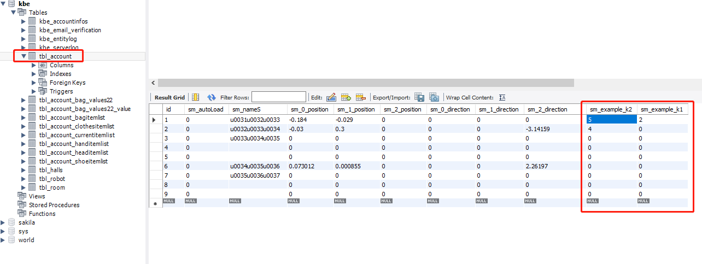
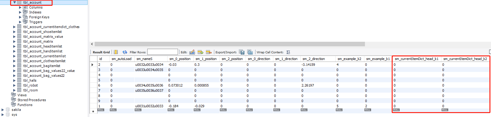
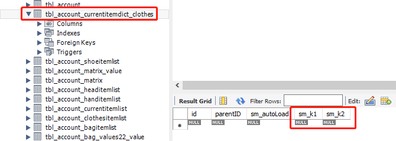
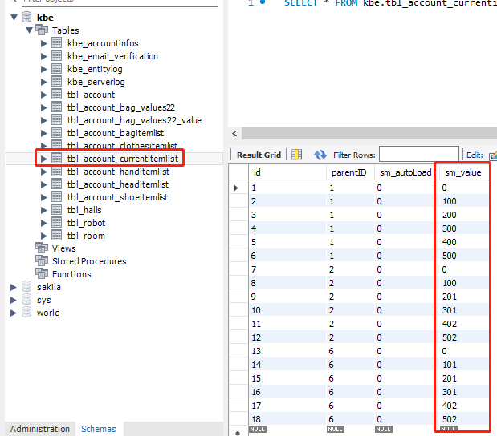
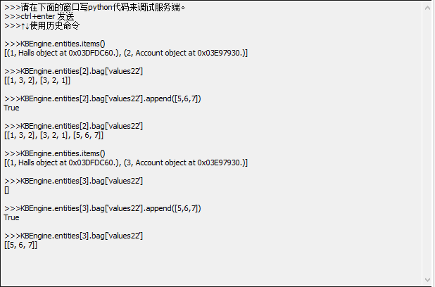
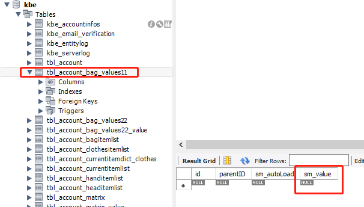
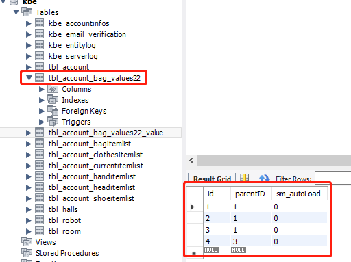
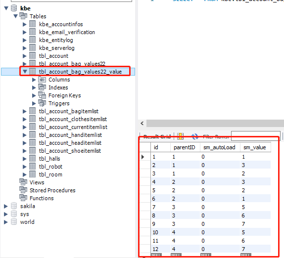
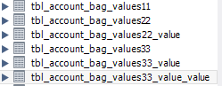

# 关于各个格式在sql中的储存形式

## 1. FIXED_DICT

### 1. 形式

单一的FIXED_DICT中的各个键值会作为表account中的属性进行存储，是一种比较简单的数据类型，并且根据官方说明，也进行了相应优化

### 2. 范例

1. type.xml 中定义 EXAMPLES

    ```xml
    <EXAMPLES> FIXED_DICT
        <Properties>
            <k1>
                <Type>    INT64    </Type>
            </k1>

            <k2>
                <Type>    INT64    </Type>
            </k2>
        </Properties>
    </EXAMPLES>
    ```

2. Account.def中给定属性

    ```xml
    <Properties>
        <example>
            <Type>         EXAMPLES           </Type>
            <Flags>        BASE_AND_CLIENT    </Flags>
            <Default>                         </Default>
            <Persistent>    true              </Persistent>
        </example>
    </Properties>
    ```

3. 其在sql中的保存形式如下图所示



## 2. 嵌套FIXED_DICT

### 1. 形式

嵌套的FIXED_DICT会在sql中并不会新形成一个表，而是根据键值排列在account表中

### 2. 范例

1. type.xml 中定义 EXAMPLES 和 EQUIP_DICT

    ```xml
    <EXAMPLES> FIXED_DICT
        <Properties>
            <k1>
                <Type>    INT64    </Type>
            </k1>

            <k2>
                <Type>    INT64    </Type>
            </k2>
        </Properties>
    </EXAMPLES>

    <EQUIP_DICT>    FIXED_DICT
        <Properties>
            <head>
                <Type>    EXAMPLES     </Type>
            </head>
            <clothes>
                <Type>    ARRAY <of> EXAMPLES </of>    </Type>
            </clothes>
        </Properties>
    </EQUIP_DICT>
    ```

2. Account.def中给定属性

    ```xml
    <Properties>
        <currentItemDict>
            <Type>        EQUIP_DICT          </Type>
            <Flags>        BASE_AND_CLIENT    </Flags>
            <Default>                         </Default>
            <Persistent>    true              </Persistent>
        </currentItemDict>
    </Properties>
    ```

3. 其在sql中的保存形式如下图所示

    其中，key head的相关value会直接接在the_account中，一直扩展到EXAMPLES的所有key

    

    而key clothes的type为array，则新生成了一个表格，然后将扩展到EXAMPLES的所有key

    

## 3. ARRAY

### 1. 形式

单一的ARRAY会在sql中以单一的表存在，并会标记parent id，从而对应相应玩家

### 2. 范例

1. type.xml 中定义 ITEM_LIST

    ```xml
    <ITEM_LIST> ARRAY <of>  INT32  </of>  </ITEM_LIST>
    ```

2. Account.def中给定属性

    ```xml
    <Properties>
        <currentItemList>
            <Type>         ITEM_LIST          </Type>
            <Flags>        BASE_AND_CLIENT    </Flags>
            <Default>                         </Default>
            <Persistent>    true              </Persistent>
        </currentItemList>
    </Properties>
    ```

3. 其在sql中的保存形式如下图所示

    

## 4. 嵌套ARRAY

### 1. 形式

不论外层是ARRAY，还是FIXED_DICT，嵌套的ARRAY会在sql中形成两个表，第一个表用来记录外层array的行数及其parent id，第二个表用来记录内层array的值及其parent id（相应值对应于第一个表的id）

### 2. 范例

1. type.xml 中定义 ITEM_LIST

    ```xml
    <BAG> FIXED_DICT
        <Properties>
            <values11>
                <Type>    ARRAY <of> INT64 </of>    </Type>
            </values11>
            <values22>
                <Type>    ARRAY <of> ARRAY <of>INT64 </of></of>    </Type>
            </values22>
        </Properties>
    </BAG>
    ```

2. Account.def中给定属性

    ```xml
    <Properties>
        <bag>
            <Type>         BAG                </Type>
            <Flags>        BASE_AND_CLIENT    </Flags>
            <Default>                         </Default>
            <Persistent>    true              </Persistent>
        </bag>
    </Properties>
    ```

3. 首先通过console进行一些修改

    

4. 其在sql中的保存形式如下图所示

    对于key values11则新建1个表，如图所示
    

    对于key values22则新建2个表，第一个表如图所示

    

    第二个表如图所示

    

## 4. 结论

1. FIXED_DICT内的key只会扩展为父表的属性，不会新建表

2. ARRAY则会新建一个表格，通过parent id记录与父表中account的对应关系

3. 各个property所形成表格的命名基本形式为

    ```txt
    the_account[属性名]_[关键字名]_value...
    ```

    列表嵌套时没有关键字，通过叠加value建立新表
    
